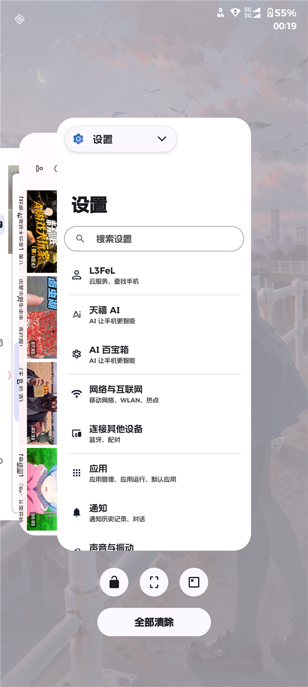

# Axion Recents — 堆叠式最近任务 for Motorola Android 16（KernelSU / Magisk 模块）

把 **AxionOS 的 Launcher3**（Lineage/Trebuchet 派生，带 `AxStack*` 堆叠式 Overview 代码）
作为一个系统级 priv-app 镜像 + 一条静态框架 RRO 带到 Motorola Android 16 上：
上滑打开的不再是原厂那种横向卡片，而是**牌堆式（stacked / deck）最近任务**。

> **English TL;DR** — A KernelSU/Magisk module that ports the AxionOS/Lawnchair-derived
> stacked-overview Launcher3 to Motorola Android 16 (SDK 36). It magic-mounts the launcher as a
> system priv-app, ships a static framework RRO that redirects `config_recentsComponentName` to it,
> and hands over the HOME role at boot (with a boot-loop guard and a crash-loop watchdog).
> Flash the zip in the manager, reboot, done. To return to the stock launcher: disable the module
> and reboot. Requires root + KernelSU. See [`docs/HOW-IT-WORKS.md`](docs/HOW-IT-WORKS.md) for the
> mechanism. Licence: GPL-3.0.

**当前版本 v1.0**（首个公开发布版）。模块 ID `axion_recents`。



---

## 1. 它做了什么

| 项目 | 说明 |
| --- | --- |
| 最近任务样式 | 堆叠/牌堆式 Overview：卡片叠放在一起，可上下拖拽翻看，左右滑走卡片 |
| 桌面 | 同一个包（`com.android.launcher3`）同时充当 HOME，外观是 Axion/Lawnchair 风格的 Launcher3 |
| 原厂桌面 | 文件**完全不动**（`/system_ext/priv-app/Launcher3QuickStep/`、`/product/overlay/framework-rro-launcher3.apk` 都原位保留），只在其上层叠加本模块 |
| 安装后要配置什么 | 不需要。刷入 → 重启 → 自动生效 |
| 怎么回原厂 | KernelSU 里**停用本模块** → 重启（见 §4） |

## 2. 兼容性 / 前提

* **必须**：能 root、装有 **KernelSU**（或 KernelSU-Next / 支持 magic mount 的 Magisk）。
  模块要把文件挂进 `/system_ext/priv-app`、`/system_ext/etc/permissions` 并放置
  `/system/product/overlay` 下的静态 RRO。
* **目标机型**：Motorola Android 16 / SDK 36，原厂桌面为
  `com.motorola.launcher3`（`/system_ext/priv-app/Launcher3QuickStep/Launcher3QuickStep.apk`）。
  本模块的 RRO、privapp 权限白名单、`versionCode` 都是针对这台机器的实测结果做的；
  **换机型/换 ROM 不保证能用**，请先备份数据并确保能进 KernelSU 安全模式。
* **已知限制**：
  * `config_recentsComponentNameForCli`（Moto Smart Connect 的 CLI 形态）**故意不覆盖** ——
    本 port 没有对应的 CLI recents activity 可指。
  * Axion 生效期间，**原厂桌面不可用**（点它会在 `RecentsAnimationDeviceState.<init>` 抛
    `SecurityException`）。这是 AOSP 的设计：`signature|recents` 的 `MANAGE_ACTIVITY_TASKS`
    只授予 `config_recentsComponentName` 指向的那个包。要回原厂请按 §4 停用模块。
  * 系统 OTA 会覆盖 `/system*`，OTA 之后需要重新刷模块。

## 3. 安装

1. 从本仓库的 **Releases** 页面下载 `AxionRecents-v1.0.zip`（并核对 sha256）。
2. KernelSU 管理器 → **模块** → **从本地安装** → 选择该 zip → 重启。
3. 重启后约 1 分钟，模块会自己做完自检。**务必等它通过再动手**：

   ```bash
   adb shell su -c 'tail -n 40 /data/adb/axion_recents.log'   # 期望看到 "watchdog: healthy after"
   adb shell su -c 'cmd overlay lookup android android:string/config_recentsComponentName'
   # 期望：com.android.launcher3/com.android.quickstep.RecentsActivity
   adb shell su -c 'cmd role get-role-holders --user 0 android.app.role.HOME'
   # 期望：com.android.launcher3
   ```

4. 使用：在任意 app 里从屏幕底部**上滑并停顿**即进入堆叠后台；卡片上下拖拽翻看，
   左右滑走关闭。

> 上滑触发的是系统手势（`OtherActivityInputConsumer`），Quickstep 的既有手势都能用，
> 不需要额外设置。

## 4. 回原厂桌面 / 卸载

| 目标 | 操作 |
| --- | --- |
| 回原厂桌面（保留模块，随时切回来） | KernelSU 管理器里**停用** `axion_recents` → 重启 |
| 再回到 Axion 堆叠后台 | KernelSU 管理器里**启用** → 重启 |
| 完全卸载 | KernelSU 管理器里**卸载** → 重启（或 recovery 里删 `/data/adb/modules/axion_recents`） |

**为什么停用就够了**：停用后 KernelSU 不挂载本模块的任何文件 ⇒ 我们的静态 RRO 不存在 ⇒
`config_recentsComponentName` 仍是原厂 `com.motorola.overlay.launcher3` 那一份的值 ⇒
recents 组件与 `MANAGE_ACTIVITY_TASKS` 都留在 `com.motorola.launcher3`，HOME 也归它。
（这条路径在真机上实测过；原厂 APK / RRO / 权限白名单全程没有被改写。）

## 5. 安全网（模块自带）

* **开机失败自动停用**：`post-fs-data.sh` 记账开机次数；若上一次模块生效的开机没有留下
  “健康”标记，连续 3 次后自动写入 `disable` 并跳过所有挂载 ⇒ 下一次重启自动回到原厂状态。
* **崩溃循环看门狗**：`service.sh` 在开机后的 160 s 窗口里统计桌面崩溃；判定崩溃循环后
  会把 HOME 还给原厂桌面、停用本模块，并自动重启一次到干净的原厂状态。
* **日志**：`/data/adb/axion_recents.log`（流程）、`/data/adb/axion_recents_diag.log`（诊断快照，
  含崩溃/权限拒绝证据）。出问题时先把这两份日志抓下来。
* **手动复位**（修好之后想重新启用）：

  ```bash
  adb shell su -c 'rm -f /data/adb/modules/axion_recents/disable \
                          /data/adb/axion_recents_bootcount \
                          /data/adb/axion_recents_crashloop'
  # 然后在 KernelSU 里启用模块并重启
  ```

## 6. 它是怎么工作的（简版）

1. `post-fs-data.sh`（开机最早阶段）：把 `payload/AxionLauncher3.apk` 与 privapp 权限白名单
   分别镜像进 `/system_ext/priv-app/AxionLauncher3/`、`/system_ext/etc/permissions/`
   （目录级 tmpfs 镜像；原厂目录一个字节都没改）。
2. 静态 RRO `AxionRecentsOverlay.apk`（`priority 100`，盖住原厂 `priority 1` 的那条）把
   `android:string/config_recentsComponentName` 指到
   `com.android.launcher3/com.android.quickstep.RecentsActivity`。
3. `service.sh` / `boot-completed.sh`：确认 RRO 真的生效（看 OMS 的实际取值）之后，把 HOME
   角色交给 `com.android.launcher3`，并做上面说的自检与看门狗。
4. 之后：recents 由 Axion 的 Quickstep 提供，HOME 是同一个包，原厂桌面被系统停用。

细节（为什么不直接把 APK 塞进原厂目录、为什么必须交接 HOME、binder 回调怎么解析）见
[`docs/HOW-IT-WORKS.md`](docs/HOW-IT-WORKS.md)。

## 7. 常见问题

**刷完重启，后台还是原厂样式？**
先看 RRO 是否生效：`su -c 'dumpsys overlay | grep -A3 com.axion.recents.overlay'`（期望
`mState=STATE_ENABLED`），再看日志里 `=== HOME role (recents=…) ===` 一行里 `recents=` 的值。
如果是不生效，把日志发到 issue。

**开机进不去系统 / 桌面反复崩溃？**
模块的熔断会自己救回来（自动停用 + 下一次重启回原厂）。也可以手动：KernelSU 安全模式，
或 recovery / `adb shell su` 下 `touch /data/adb/modules/axion_recents/disable` 后重启。

**原厂桌面点不开、一开就崩？**
这是预期行为，原因见 §2 的已知限制：同一时刻只有一个 recents 组件。要回原厂桌面必须
**停用模块 + 重启**。

**模块树里我把 `system/product/overlay/AxionRecentsOverlay.apk` 删了会怎样？**
会变成“HOME 归 Axion、recents 归原厂”的不一致状态 ⇒ 桌面崩溃循环 ⇒ 看门狗回滚并停用模块。
正常安装不会出现这种情况；请勿手动删它。

**换了新手机 / 刷了别的 ROM 能用吗？**
不保证。本模块的 RRO 目标、权限白名单、原厂包名都是针对 Motorola Android 16 的实测结果。

## 8. 构建（维护者）

```powershell
# 打包可刷写的 zip（版本号取自 module.prop）→ dist\AxionRecents-v<version>.zip
pwsh -File tools\build-zip.ps1

# 重新编译 + 签名静态 RRO（需要 Android SDK build-tools 36 + JDK；输出到 payload/）
pwsh -File tools\build-rro.ps1 -SdkRoot "$env:ANDROID_SDK_ROOT"
```

`payload/AxionLauncher3.apk` 是预编译产物（来自 AxionOS/Lawnchair 派生的 Launcher3 源码，
包名改成 `com.android.launcher3`，含 `AxStack*` 堆叠后台实现），本仓库直接以二进制形式分发。

## 9. 文件结构

```
AxionRecents/
├── module.prop                     # 模块元数据（id / 版本 / 描述）
├── customize.sh                    # 刷入钩子：chmod + chcon
├── post-fs-data.sh                 # 目录级 tmpfs 镜像 + 开机计数 / 熔断闸口
├── service.sh                      # 开机自检、RRO 生效判定、HOME 交接、崩溃循环看门狗
├── boot-completed.sh               # 开机完成后再确认一次并交接 HOME
├── payload/
│   ├── AxionLauncher3.apk          # 被打进 /system_ext/priv-app 的 Axion 桌面（com.android.launcher3）
│   ├── AxionRecentsOverlay.apk     # 静态框架 RRO（只改 config_recentsComponentName）
│   └── privapp-permissions-com.android.launcher3.xml
├── rro/                            # RRO 源码（AndroidManifest.xml + res/values/strings.xml）
├── tools/
│   ├── build-zip.ps1               # 打包可刷写 zip
│   ├── build-rro.ps1               # 编译 + 签名 RRO
│   └── axion-recents.jks           # RRO 签名用的密钥（签名无需与目标一致，见 docs/HOW-IT-WORKS.md）
├── docs/
│   ├── HOW-IT-WORKS.md             # 原理（RRO / tmpfs 镜像 / HOME 交接 / binder 回调）
│   └── screenshot.png
├── CHANGELOG.md
└── LICENSE                         # GPL-3.0
```

## 10. 许可 / 致谢

* 本仓库（模块脚本、RRO 源码、文档）以 **GPL-3.0** 发布，见 [`LICENSE`](LICENSE)。
* `payload/AxionLauncher3.apk` 由 **AxionOS / Lawnchair / AOSP Launcher3** 派生的源码构建，
  相应权利归其各自作者；`AxStack*` 堆叠式 Overview 实现来自 AxionOS/Lawnchair 一侧。
* 感谢 AOSP Launcher3、Lawnchair、AxionOS 以及 KernelSU 生态。
